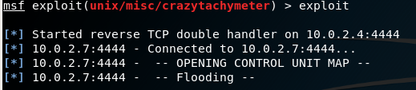
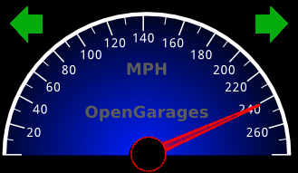

# Crazy-Tachymeter
Crazy-Tachymeter is an exploit that allows you to flood the CAN-Bus with frames in the ECU mapping file.

This project uses a CAN simulator (ICSim by OpenGarages). [[Link]](https://github.com/zombieCraig/ICSim)



### What do you need
1) Virtual Machine with a CAN simulator installed. On this VM you also need a vulnerable server for remote command execution.
2) Kali Linux with this exploit included.

### How to setup the environment
- Download the vulnerable VM with CAN simulator installed from Release. (Bodhi-Linux, user=pass=tachymeter)
- On Kali Linux, copy the:

  */exploit/crazytachymeter.rb* --> to --> */usr/share/metasploit-framework/modules/exploits/unix/misc/* .
  
  Then copy the
  
  */exploit/controlUnitMapCanBus.txt*  --> to --> */usr/share/metasploit-framework/data/wordlists/controlUnitMapCanBus.txt*
  
### How to setup the Vulnerable VM
Open a terminal and run the following commands to setup a virtual can interface
```
  sudo modprobe can
  sudo modprobe vcan
  sudo ip link add dev vcan0 type vcan
  sudo ip link set up vcan0
```
After that, open two terminal and enter on ICSim directory, then use the following commands for startup simulator and controller.
```
  ./icsim vcan0
  ./controls vcan0
```
At this point you need to start the vulnerable server for remote command execution.
```
  cd Documents
  python vulnerable_server.py
```
