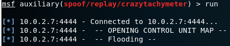
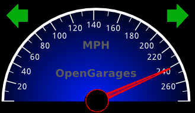

# Crazy-Tachymeter
Crazy-Tachymeter is an exploit that allows you to flood the CAN-Bus with frames of the ECU mapping file.

This project uses a CAN simulator (ICSim by OpenGarages). [[Link]](https://github.com/zombieCraig/ICSim)



### What do you need
1) Virtual Machine with a CAN simulator installed. On this VM you also need a vulnerable server for remote command execution.
2) Kali Linux with this exploit included.
3) Make sure the machines are connected each other.


### How to setup the Vulnerable VM
Download the vulnerable VM with CAN simulator installed from **Release**. (Bodhi-Linux, user=pass=tachymeter)

Open a terminal and run the following commands to setup a virtual CAN interface.
```
  sudo modprobe can
  sudo modprobe vcan
  sudo ip link add dev vcan0 type vcan
  sudo ip link set up vcan0
```
After that, open two terminal and enter on ICSim directory, then use the following commands for startup simulator and controller.
```
  ./icsim vcan0
  ./controls vcan0
```
At this point you need to start the vulnerable server for remote command execution.
```
  cd Documents
  python vulnerable_server.py
```
Now your VM is ready and vulnerable for the exploit.
### How to setup the exploit on Kali Linux
On Kali Linux, copy the:

  */exploit/crazytachymeter.rb* --> to --> */usr/share/metasploit-framework/modules/auxiliary/spoof/replay/*
  
  Then copy the
  
  */exploit/controlUnitMapCanBus.txt*  --> to --> */usr/share/metasploit-framework/data/wordlists/controlUnitMapCanBus.txt*

After that, open the msfconsole and then, enter the following commands:
```
  use auxiliary/spoof/replay/crazytachymeter 
  set RHOST [IP_Victim]
  set RPORT [PORT_Victim]
  set INTERFACE canbusinterface (e.g. vcan0)
  run
```
Now you can see the exploit running.. Look at the tachymeter.
You can also change the path of the file with a new ECU mapping!

Enjoy!
